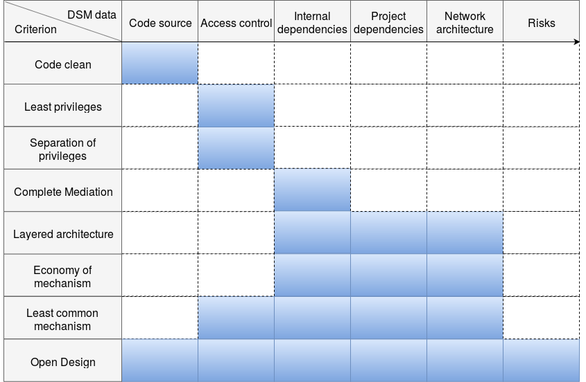

Roadmap
=======

Archan currently checks for criteria that are only applicable on DSM
representing either internal dependencies of an application, or access
control rights.

In fact, it is possible to represent many different things with DSM.
Also, each criterion does not apply to each of these different things.
Hence, we can build the following matrix, with the different types of DSM
data, and the different criteria to check against the DSMs.

The arrow going from left to right in the header represents the scale
growing up: from the code source to dependency data to network architecture
to risk analysis.

The blue cells indicate that the criterion can be run on the related type
of DSM. As you can see, Open Design criterion can be checked against any
type of DSM, as it is just a matter of telling if yes or no the design of
the entity is open. At the contrary, Code Clean criterion is only applicable
on code source. Least Privileges and Separation of Privileges criteria are
only applicable on access control data since it requires roles and privileges
data to be checked (software dependencies do not offer such data).

However, everything in this matrix is not fixed. We could maybe imagine
running a Complete Mediation check on the network architecture or a
Layered Architecture check on access control data. The only limit is
imagination: what data to present, how to generate them, how to check them.

The risk column is a perfect example: we could define risks for pretty much
each kind of entity: code source, access control, network architecture..., but
against which criteria can we check them? This has yet to be specified.
